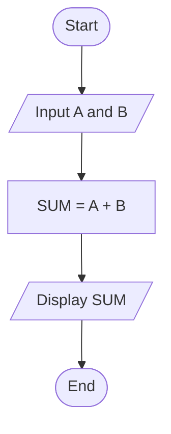

# Algorithm, Flowchart, and Pseudocode

## 1) Algorithm

### Definition
An **algorithm** is a finite, step-by-step set of instructions used to solve a problem or perform a task.

### Characteristics of an Algorithm
- **Input:** It may take zero or more inputs.
- **Output:** It must produce at least one result.
- **Definiteness:** Every step should be clear and unambiguous.
- **Finiteness:** It must end after a limited number of steps.
- **Effectiveness:** Each step should be simple and practical to carry out.
- **Correctness:** It should give the correct result for the problem.

### Example of an Algorithm: Add Two Numbers
1. Start
2. Read two numbers, `A` and `B`
3. Compute `SUM = A + B`
4. Display `SUM`
5. Stop

---

## 2) Flowchart

### Definition
A **flowchart** is a graphical representation of an algorithm or process using symbols and arrows to show the sequence of steps.

### Flowchart Symbols and Notations

| Symbol | Name | Function |
|---|---|---|
| Oval / rounded rectangle | Start/End | Indicates the start or end of a process. |
| Rectangle | Process | Describes a specific action or step performed within the process. |
| Diamond | Decision | Denotes a question or condition to be evaluated. Also shows different options based on the condition. |
| Circle | Connector | Used to connect different parts of a diagram that are in separate locations. |
| Arrow | Flow arrow | Represents the direction of the process flow, indicating the order in which actions are carried out. |
| Parallelogram | Input/Output | Represents data entering or leaving the system. |
| Document | Document | Refers to an external document. |
| Multiple documents | Multi-document | Indicates several printed documents or reports. |

### Example of a Flowchart for Adding Two Numbers



---

## 3) Pseudocode

### Definition
**Pseudocode** is a simple, human-readable way of writing the steps of an algorithm using structured English.

### Example of Pseudocode: Add Two Numbers
```text
START
    INPUT A, B
    SUM ← A + B
    OUTPUT SUM
END
```

---

## Summary
- **Algorithm:** Step-by-step solution to a problem.
- **Flowchart:** Diagram that shows the steps of an algorithm.
- **Pseudocode:** Informal text description of an algorithm that is easy to understand and convert into code.
